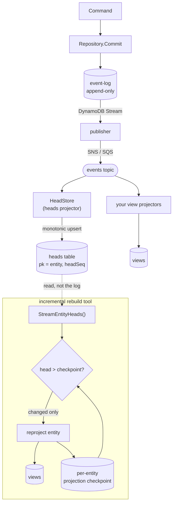

# Projections and Rebuilds

Projection rows are deterministic read models derived from immutable events.

Use `evt.RebuildProjections` when:

- a projector bug wrote incorrect view rows
- a new view is added for existing aggregate streams
- a view payload schema changes
- an operator wants to validate projection health against the event log

During a rebuild, the repository streams entities, the caller-supplied replay
function reconstitutes aggregate state, and projectors produce transaction
groups. In dry-run mode, `evt` reports the work without writing rows.

The rebuild contract deliberately makes writes explicit through `CommitGroup` so
adopters can choose the safest commit strategy for their storage backend.

## Scanning the event log

`RebuildProjections` reads the whole event log through `StreamEntities`, which is
backed by a DynamoDB `Scan`. A `Scan` makes no ordering guarantees, so
`StreamEntities` groups every matched event by entity and applies each entity's
events in sequence order before yielding it. As a result it buffers the matched
events in memory for the duration of the scan — it is a rebuild/diagnostic path,
not a hot read path.

For large tables, configure a parallel scan on the DynamoDB repository before
passing it to `RebuildProjections`:

```go
repo := dynamo.NewRepository(client, eventsTable).WithScanSegments(8)
res, err := evt.RebuildProjections(ctx, repo, applyEvent, cfg)
```

`WithScanSegments(n)` sweeps the table with `n` parallel segments, trading higher
read throughput (and consumed capacity) for a faster rebuild. Leave it at the
default (a single sequential scan) for small tables.

### Bounded-memory rebuilds for large tables

Because `StreamEntities` must regroup an unordered scan, it holds the matched
events in memory until the scan finishes. For large event logs, use the dynamo
repository's `StreamEntitiesByQuery`, which first enumerates the distinct entity
IDs with a key-only scan (`ProjectionExpression` on `pk`) and then queries each
entity's partition — returning its events already in order — folding and emitting
one entity at a time. Memory is bounded to the set of entity IDs plus a worker
pool of in-flight aggregates, and entities stream out as they are rebuilt. Pass
the resulting stream to `RebuildProjectionsFromStream`:

```go
repo := dynamo.NewRepository(client, eventsTable)
stream := repo.StreamEntitiesByQuery(ctx, dynamo.StreamByQueryOptions{
    EntityType: cfg.EntityType, // optional filter
    Workers:    8,              // partitions queried concurrently
    // Skip lets you resume an interrupted run; rebuilds are idempotent, so a
    // full restart is also always safe.
    Skip: func(id evt.EntityID) bool { return false },
}, applyEvent)

res, err := evt.RebuildProjectionsFromStream(ctx, stream, cfg)
```

`RebuildProjections` is the convenience wrapper that builds the scan-based stream
for you; `RebuildProjectionsFromStream` accepts any entity stream so you can pick
the strategy that fits your table size.

Note on cost: enumeration is still a table `Scan`. A `ProjectionExpression`
reduces the data returned over the wire but **not** the read capacity consumed —
DynamoDB charges scan RCUs by the size of the items read, not the attributes
projected. So enumeration consumes read capacity comparable to scanning the full
log; the win here is bounded memory, incremental output, and parallel per-entity
queries, not lower read cost. For genuinely cheaper, constant-memory enumeration,
back it with a heads registry — see [Constant-memory enumeration](#constant-memory-enumeration)
below.

### Incremental rebuilds with an entity-heads table

A full rebuild reprocesses every entity even when only a handful changed since the
last run, and (per the note above) enumeration reads capacity comparable to the
whole log. To rebuild only what changed, keep a small **heads table**: one row per
entity (`pk` = entity ID) holding that entity's highest event sequence. Reading it
is a scan of a few small rows, not the event log, so change detection is cheap.

The heads table is maintained like any other read model — by a projector on the
event stream — so it adds nothing to the commit path, and its per-entity-keyed
writes stay distributed (no hot partition, no global counter, no secondary index).



`dynamo.HeadStore` plays both projector and reader roles. Putting the pieces
together:

**1. Provision the heads table** — one attribute, the partition key (`pk`); no sort
key, no index. `entityType` is a plain attribute the reader filters on, not a key.

**2. Maintain it with a projector Lambda**, subscribed to the same event stream your
other projectors use. The upsert is monotonic, so re-deliveries and out-of-order
events fail the condition and are no-ops — durable idempotency is optional:

```go
heads := dynamo.NewHeadStore(client, "my-entity-heads")
runtime := projectors.NewRuntime(heads, projectors.NewInMemoryIdempotencyGuard(), logger)
// runtime.Process(ctx, records) from your SNS/SQS handler — see streams.md.
```

**3. Seed it once** from the existing log before the first incremental run, so
entities that predate the projector are present. `Backfill` takes any
`EntityHeadStreamer` source — typically a `Repository`, whose `StreamEntityHeads`
folds the log (the one place a full scan remains). Call once per entity type to
record the type on each row:

```go
for _, t := range myEntityTypes {
    if _, err := heads.Backfill(ctx, repo, t); err != nil { /* ... */ }
}
```

**4. Detect and reproject** in the rebuild tool: read every head, compare against a
per-entity projection checkpoint you store alongside your views (the sequence each
view was last built from), and reproject only the entities whose head moved.

```go
current, err := heads.StreamEntityHeads(ctx, "") // all types; few-MB scan
// for id, head := range current:
//   if head > checkpoint[id] { reproject(id); checkpoint[id] = head }
```

Compare with `>`, not `!=`: heads only advance, so a strictly-greater test reprojects
exactly the entities that moved. It also keeps detection correct under the eventually
consistent read above — a stale head that briefly reads *behind* the checkpoint is
simply skipped, never regressing the checkpoint or forcing a redundant reprojection.

The reader is eventually consistent by default (half the RCU cost); a head that lags
a beat only defers an entity to the next rebuild, never skips it. Derive a strongly
consistent variant with `heads.WithConsistentRead(true)` if a read must reflect the
latest projector write.

**Recovering a lagged head.** The heads table is a projection, so it is only as
current as its projector. If a delivery is permanently dropped (for example, a record
exhausted its retries and went to a dead-letter queue), that entity's head can lag the
log, and change detection would treat it as unchanged and skip its reprojection. The
fix is the same operation that seeds the table: re-run `Backfill` from the log, whose
heads are authoritative. Because the upsert is monotonic, backfill only ever advances a
lagging head and is safe to run anytime — concurrently with the live projector and as
often as you like — so a periodic backfill (or one after draining a DLQ) keeps the
table from drifting.

`EntityHeadStreamer` is backend-neutral, so a non-DynamoDB backend can satisfy it
its own way (for example, a SQL backend with `SELECT entity_id, MAX(sequence) …`).
The in-memory repository implements it directly over its event map for tests. The
head accounts for a compacted stream's snapshot floor, so it stays correct after
`CompactBelow`.

#### Constant-memory enumeration

`StreamEntityHeads` returns a `map[EntityID]EventSequence` — convenient, but the
map grows with the number of entities, so a rebuild's memory ceiling scales with
the table. For a genuinely constant-memory pass, `HeadStore` also implements the
streaming `evt.EntityHeadVisitor`:

```go
err := heads.StreamEntityHeadsFunc(ctx, "", func(id evt.EntityID, head evt.EventSequence) error {
    if head > checkpoint(id) { // your per-entity projection checkpoint
        reproject(id)
    }
    return nil // return an error to stop enumeration early
})
```

This pages the heads table and invokes the callback once per row, never holding
more than one page in memory. It is sound here precisely because the heads table
holds **one row per entity**: the rows are already unique, so enumeration needs no
dedup set (unlike the event-log scan, where a partition key repeats once per event)
and resumes naturally from each page's last key. `EntityHeadVisitor` is
backend-neutral for the same reason `EntityHeadStreamer` is — a SQL backend can
stream a cursor over `SELECT entity_id, MAX(sequence) …`.

To drive a bounded-memory **rebuild** from the registry instead of a scan, set
`StreamByQueryOptions.HeadSource` (any `EntityHeadVisitor`, e.g. a `HeadStore`):

```go
stream := repo.StreamEntitiesByQuery(ctx, dynamo.StreamByQueryOptions{
    Workers:    8,
    HeadSource: heads, // enumerate IDs from the registry, not a key-only event-log scan
}, applyEvent)
```

With `HeadSource` set, entity IDs stream straight from the registry to the worker
pool with no dedup set — so enumeration memory no longer grows with entity count —
while each entity's events are still read from its own event-log partition. It is
opt-in and requires the heads table to be populated (maintained by the projector
and seeded with `Backfill`); leave it nil to keep the no-schema-change
scan-and-dedup default. Unlike that default — which collects every ID up front and
fails before emitting anything if enumeration errors — the registry path emits
entities as it enumerates, so a mid-enumeration failure surfaces as a stream error
after some entities were already emitted. Rebuilds are idempotent, so re-run from
scratch or resume past finished work with `Skip`.

## Rebuilding compacted streams

By default a rebuild replays each stream from event sequence 1. If a stream has
been **compacted** (`evt.Compactor.CompactBelow` truncates events that a durable
snapshot already captures), those low events no longer exist, so a from-event-1
replay would reconstruct incorrect state.

For compacted streams, set `RebuildConfig.SeedEntity`. The rebuild then seeds each
entity from its snapshot before applying only the post-snapshot events (via
`evt.SnapshotStreamer`), and falls back to full replay for streams that have no
snapshot. This is safe on uncompacted data too, so adopters that plan to compact
should switch rebuilds to `SeedEntity` first:

```go
res, err := evt.RebuildProjections(ctx, repo, applyEvent, evt.RebuildConfig{
    Projectors: projectors,
    CommitGroup: commitGroup,
    SeedEntity: func(ctx context.Context, snap evt.SerializedSnapshot) (evt.Entity, error) {
        entity, err := newEntityForType(snap.EntityType) // your factory
        if err != nil {
            return nil, err
        }
        return entity, json.Unmarshal(snap.Payload, entity)
    },
})
```

Like `StreamEntitiesByQuery`, the snapshot-aware path enumerates entity IDs and
queries each partition (seeding from the `sk=0` snapshot, then applying events
after it), so it is bounded-memory and does not depend on scan ordering. If
`SeedEntity` is set but the repository does not implement `evt.SnapshotStreamer`,
`RebuildProjections` returns an error rather than silently producing partial state.
See [ADR 0001](adr/0001-event-compaction-and-snapshot-truncation.md).

## Reading views without buffering

The view repository's `ListViewsByEntityType` and `ListViewsByPK` buffer their
full result set. For large result sets prefer the cursor-based `*Paged` variants,
or the streaming iterators on the optional `evt.ViewStreamer` interface
(`ListViewsByEntityTypeEach` / `ListViewsByPKEach`), which invoke a callback per
view and stop early when it returns an error. Type-assert a `ViewRepository` to
`evt.ViewStreamer` to reach them (the DynamoDB repository implements it):

```go
if streamer, ok := repo.(evt.ViewStreamer); ok {
    err := streamer.ListViewsByEntityTypeEach(ctx, entityType, func(v *evt.SerializedView) error {
        // handle v without buffering the whole result set
        return nil
    })
}
```
